# SES日報自動化ツール 要件定義書

## 1. このプロジェクトについて

### 1.1 何を作るのか
**Googleフォームとスプレッドシートを連携させた、SES日報集約・報告下書き自動生成ツール**

本プロジェクトでは、メンティの日報提出からクライアント報告までのフローを半自動化し、担当者の管理工数を削減するシステムを構築します。
具体的には以下の機能を持ち、「担当者が安心して最終確認できる状態」までを自動化します。

1. **入力インターフェース（Googleフォーム）**
* メンティが日々の作業内容を定型フォーマットで入力し、その回答データを「個人用スプレッドシート」へ自動蓄積する機能。

2. **データ自動集約・転記機能（GAS × スプレッドシート）**
* 個人用スプレッドシートに蓄積されたデータを抽出し、集約用スプレッドシートへ転記する機能。
* 定刻実行に加え、担当者の任意のタイミングでの手動実行にも対応。
* 「未処理データの抽出」「二重取り込み防止（冪等性の担保）」を徹底し、データの整合性を保証。

3. **報告用下書きの生成**
* 集約データをクライアント報告用のフォーマットに整形し、出力する機能。

4. **確認フローの可視化**
* 集約用スプレッドシート上に「送信完了確認」機能を設け、担当者が「どこまで送信したか」を確実に管理できるようにする。
* ※誤送信防止のため、クライアントへの自動送信機能は含まない。

  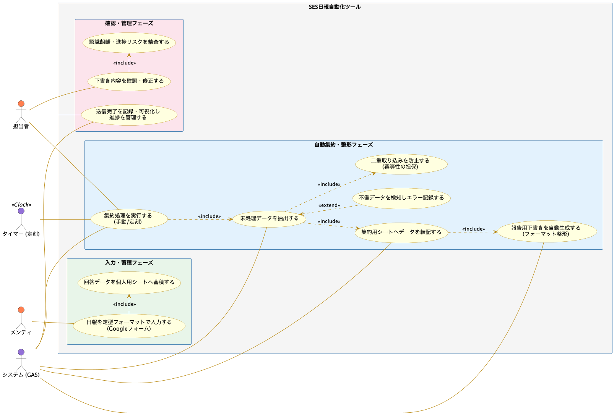

### 1.2 なぜ作るのか
報告業務における「人為的ミスの排除」と「管理コストの最小化」を実現するため、現状の手動運用や単純な転記作業では防ぎきれないリスクを解消します。
これにより、担当者が「内容のフィードバック」に集中できる環境を作ると同時に、日々の報告を通じてクライアントとメンティとの間に認識の相違がないかを確認・是正することも目的としています。

1. **事故の未然防止（リスクヘッジ）**
* 手作業によるコピペミス、誤送信、二重計上などのヒューマンエラーをシステム的に排除。
* システムが停止してもデータが壊れない堅牢性を確保し、信頼性の高い報告業務を維持。

2. **確認・集計コストの削減**
* メンティごとのフォーマットのばらつきをフォーム入力で統一し、集計の手間を削除。
* 「確認が必要な箇所」のみを明確にすることで、担当者のチェック時間を短縮。

3. **認識齟齬の早期発見**
* 日報の提出状況（未提出／提出済）を可視化し、報告漏れや遅延に対して早期にアクションを取れるようにする。

  

### 1.3 今回解決したいこと
本プロジェクトでは、以下の3つの観点から現状の課題を解決し、理想的な運用フローへの移行を目指します。

1. **報告業務の「非効率」と「表記揺れ」の解消**
* **【Before】** メンティが自由記述で報告を行うため、フォーマットが統一されておらず、担当者が集約時に整形・修正する手間が発生している。
* **【After】** Googleフォームによる選択式入力を導入し、表記揺れを根本から排除。整形不要でそのまま報告に使えるデータを自動生成する。

2. **「ヒューマンエラー」と「事故リスク」の排除**
* **【Before】** 手動でのコピペ作業に依存しており、転記ミス、データの重複、あるいは誤って過去の日報を再送してしまうリスクが常にある。
* **【After】** システムが「未処理データ」のみを正確に判別して抽出。何度実行してもデータが壊れない設計により、人為的ミスによる事故をゼロにする。

3. **クライアント・メンティ間の「認識齟齬」の早期発見**
* **【Before】** 報告作成（転記）自体に時間を取られ、日報の内容（作業内容の妥当性や進捗の遅れ）を精査する余裕がなく、クライアントとの認識ズレに気づくのが遅れる場合がある。
* **【After】** 作成業務の自動化により、担当者は「内容の確認」に全リソースを集中できる。日々の報告を通じてメンティの動きを把握し、クライアントの期待値とのズレがあれば即座に軌道修正を行う。

  

---

## 2. 全体のイメージ

### 2.1 日報がどのように流れるか
日報データは、以下の4つのフェーズを経てメンティからクライアントへ届きます。
本システムは「Step1」から「Step2」を自動化し、担当者が「Step3」からスタートできる状態を作ります。

* **Step1：【入力】メンティによる報告（データ発生）**
* **アクター**: メンティ
* **ツール**: Googleフォーム
* **動作**:
* メンティは日々の業務終了後、Googleフォームから作業内容・時間を入力します。
* 入力負荷を減らすため、選択式の回答を主とし、表記揺れのない「生のデータ」として**個人用スプレッドシート**に蓄積されます。

* **Step2：【集約・加工】システムによる自動処理（データ整形）**
* **アクター**: システム（GAS）
* **ツール**: GAS / 個人用スプレッドシート / 集約用スプレッドシート
* **動作**:
* システムは定期的に個人用スプレッドシートを巡回し、「未処理（チェックなし）」かつ「有効な日付」のデータがある場合に、その行のデータを抽出します。
* 抽出したデータをクライアント報告用のフォーマットに整形し、**集約用スプレッドシート**へ「下書き」として書き込みます。
* 処理完了後、元データに「済」マークを付け、二重処理を防止します。

* **Step3：【確認・監査】担当者による最終チェック（品質担保）**
* **アクター**: 担当者
* **ツール**: 集約用スプレッドシート
* **動作**:
* 担当者は、自動生成された下書きを確認します。
* 誤字脱字の確認だけでなく、「報告内容にクライアントとメンティ間の認識齟齬がないか」「進捗に問題がないか」をこの段階で精査・修正します。

* **Step4：【提出】クライアントへの送信（完了）**
* **アクター**: 担当者
* **ツール**: メール / チャットツールなど（本システム外）
* **動作**:
* 内容に問題がないことを確認した後、担当者が手動でクライアントへ報告します。
* 送信後、**集約用スプレッドシートの「送信済チェックボックス」をON**にし、業務完了を記録します。

  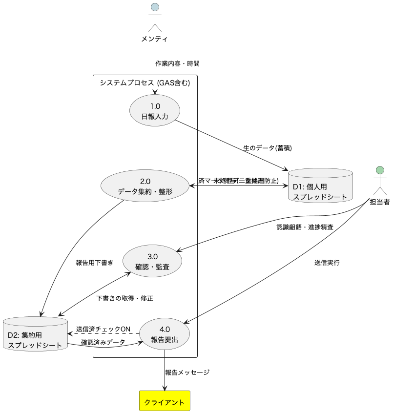

### 2.2 人がやること／自動でやることのイメージ
本システムでは、単純作業や計算・転記はすべて自動化し、人間は「内容の正しさの判断」や「責任を伴う送信」に集中する設計とします。

#### 自動でやること（システム）

**「定型作業の代行」と「整合性の担保」を担当します。**

1. **データの収集と選別**
* 個人用スプレッドシートから、まだ報告されていない（未チェックの）データのみを自動で抽出します。
* 日付がない、または必須項目が不足している不完全なデータを検知した場合、正常な集約処理からは除外します。
* ただし、担当者が不備を見落とさないよう、集約用スプレッドシートに「データ不備あり（日付なし等）」というエラー情報を記録し、処理対象から除外されたことを明示します。

2. **報告用下書きの作成**
* メンティが入力した個別の情報を、クライアント用のフォーマットに整形して集約用スプレッドシートに書き込みます。

3. **処理状態の管理**
* 処理が終わったデータには自動でチェックを入れ、処理済みの履歴を残します（二重計上の防止）。

#### 人がやること（メンティ・担当者）

**「事実の入力」と「内容の責任・判断」を担当します。**

1. **【メンティ】正確な事実入力**
* 今日の作業実績、時間、発生した課題などをGoogleフォームから入力します。
* システムが正しく動くための「質の高い一次情報」を提供します。

2. **【担当者】認識齟齬の確認と修正**
* 自動生成された下書きを見て、「進捗に無理がないか」「クライアントの意図とメンティの作業がズレていないか」を判断します。
* 必要であれば、メンティへの指導や、報告内容の修正を行います。

3. **【担当者】最終送信と完了記録**
* 内容に問題がないことを確認した上で、担当者自身の操作によってクライアントへ送信します。
* 送信後、集約用スプレッドシートのチェックボックスをONにして完了とします。

  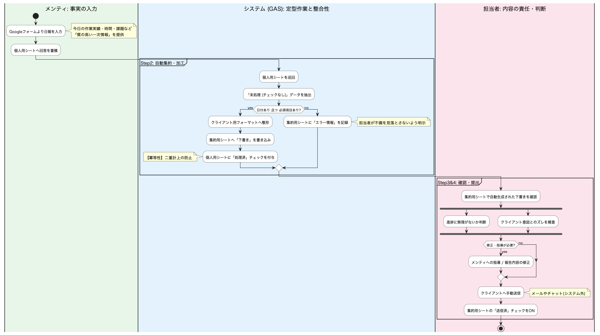

### 2.3 完成形のイメージ
本システム導入後は、Googleフォームと2種類のスプレッドシート（個人用・集約用）が連携し、以下のような状態で運用されます。

1. **入力画面：迷わず打てるGoogleフォーム**
* **見た目**: 記述式（自由入力）を極力減らし、ラジオボタンやプルダウンが並ぶシンプルな構成。
* **状態**: 「日付」や「作業項目」が定型化されているため、誰が入力しても同じ品質のデータが生成されます。

2. **管理画面：処理状態が見える個人用スプレッドシート**
* **見た目**: フォームの回答が蓄積されるリスト。行の先頭（または末尾）に「システム処理用チェックボックス」列が存在する。
* **状態**:
* **未処理行**: チェックボックスが OFF（＝これから集約される対象）。
* **処理済行**: システム実行後に自動で ON になり、「集約済み」であることが一目でわかる。
* これにより、システムがどこまで処理したかが可視化され、二重取り込みを確実に防ぎます。

3. **最終成果物：送信管理ができる集約用スプレッドシート**
* **見た目**: クライアントごとの「報告メール（チャット）下書き」が生成されている一覧表。**各行に「送信済チェックボックス」がある。**
* **状態**:
* 必要な情報（日付、作業内容、進捗、課題）が、指定のフォーマットに整形済みの状態でセルに入力されている。
* 担当者は、生成されたテキストを読み、「内容に違和感（認識齟齬）がないか」を確認する。
* 問題がなければコピペして送信し、**「送信済」チェックを入れることで、未送信データの有無が一目でわかる状態**になる。

  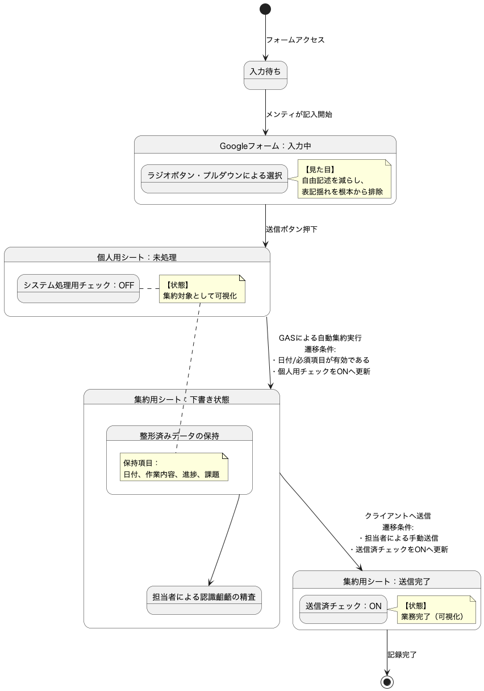

---

## 3. 扱うもの

### 3.1 メンティが使うもの
メンティは、日々の報告業務において主に以下のツールを使用します。

1. **日報入力用 Googleフォーム**
* システムへの「入り口」となるインターフェースです。自由記述による負荷とミスを減らすため、以下の工夫が施されています。
* **役割**: その日の作業実績、稼働時間、発生した課題などの一次情報をシステムへ送信する。
* **特徴**:
* **選択式UIの活用**: 作業時間や進捗ステータスはラジオボタンやプルダウンで選択させ、入力の手間を減らすとともに表記揺れをゼロにします。
* **必須入力の制御**: 必要な情報（日付、作業内容など）が欠けている場合は送信できないようにし、後工程でのエラーを防ぎます。

2. **個人用スプレッドシート**
* フォームの送信結果が蓄積されるスプレッドシートです。
* ※基本的にメンティはフォームからの入力を行いますが、過去の自分の提出履歴を確認するために参照権限を持つ場合があります。

  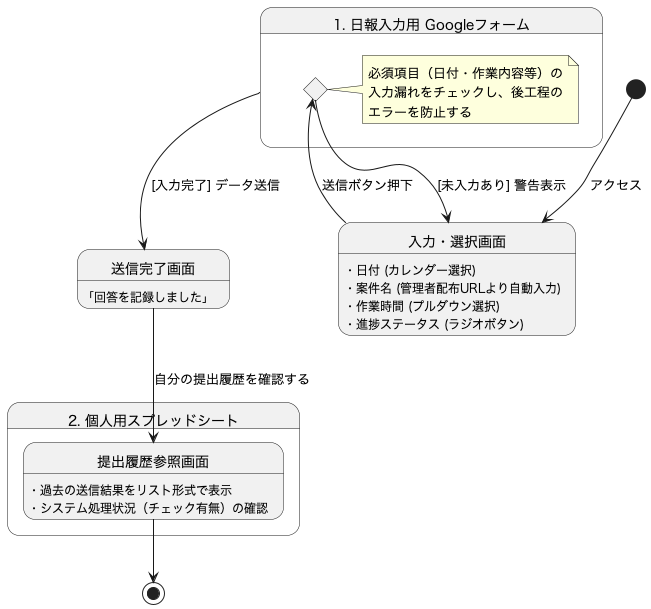

### 3.2 集約して管理するもの
システムが自動的にデータを処理し、安全に管理するために以下の要素を使用します。

1. **個人用スプレッドシート**
* メンティごとの「全データの履歴」と「処理ステータス」を管理するデータベースの役割を果たします。
* **役割**:
* フォームから送られた生の回答データを時系列で蓄積する。
* 各データが「集約済み」か「未処理」かの状態（ステータス）を保持する。

* **特徴**:
* **管理用チェックボックス**: システム処理用の列を設け、処理が完了した行には自動でチェックが入る仕組みとします。
* **冪等性の確保**: システムはこのチェックボックスを見て「未処理分」だけを抽出するため、何度プログラムを実行してもデータが重複することはありません。

2. **Google Apps Script（処理エンジン）**
* 本システムの「頭脳」にあたる部分で、定期的なトリガーまたは手動操作によって実行されます。
* **役割**:
* 個人用スプレッドシートを巡回し、データの抽出・加工・出力の一連のフローを実行する。

* **特徴**:
* **手動実行メニュー**: 担当者が任意のタイミングで集約処理を実行できるメニュー（ボタン）を提供します。
* **例外データのハンドリング**: 基本的にGoogleフォーム側で必須入力を強制しますが、万が一、スプレッドシート上での手動操作によりデータ消失や予期せぬ値の混入が発生した場合は、システム停止を防ぐため**正常な集約処理からは除外**します。
* ただし、担当者が不備を見落とさないよう、集約用スプレッドシートに「データ不備あり（日付なし等）」というエラー情報を記録し、処理対象から除外されたことを明示します。
* ※不備が修正されれば、次回実行時に正常に処理されます。

3. **集約用スプレッドシート**
* 全メンティの報告が、クライアント提出用の形式に整えられて集まる場所です。
* **役割**:
* システムによって生成された「報告メール（チャット）の下書き」を表示する。

* **特徴（確認の効率化）**:
* メンティごとにスプレッドシートやエリアを分け、担当者が一覧性を保って確認できるようにします。
* ここにあるデータはあくまで「下書き」であり、ここを編集しても元の（個人用スプレッドシートの）データには影響を与えないため、担当者は安心して修正作業が行えます。

  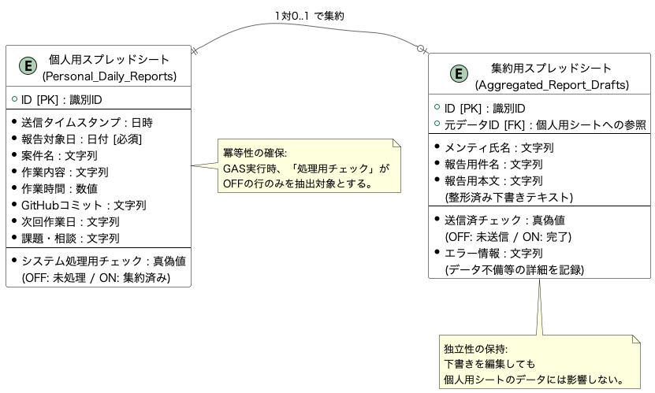

### 3.3 最終的に確認するもの
担当者は、システムが出力した以下の内容を確認し、報告の「品質」と「安全性」を最終判断します。

**集約用スプレッドシート上の「報告用下書き」**
システムによって整形・出力された、クライアントへ送信直前のテキストデータです。担当者は以下の観点でチェックします。

1. **認識齟齬の最終確認**
* **進捗の整合性**: メンティの報告内容が、クライアントの期待する進捗やスケジュールと乖離していないか確認します。
* **リスクの検知**: 「遅延の兆候」や「技術的な行き詰まり」など、文面から読み取れるリスクを検知し、必要であれば送信前にメンティへフィードバックを行います。

2. **形式と整合性の確認**
* **データの欠落**: 「空欄」や「不明な記号」など、システム処理上のエラーが含まれていないかを確認します。
* **日時の正当性**: 報告対象の日付や曜日が正しいか確認します。

3. **送信と完了記録**
* 上記を確認し、問題がなければ下書きをコピーしてクライアントへ送信します。
* **送信後、集約用スプレッドシートの「送信済」チェックボックスをONにし、業務完了とします。**

  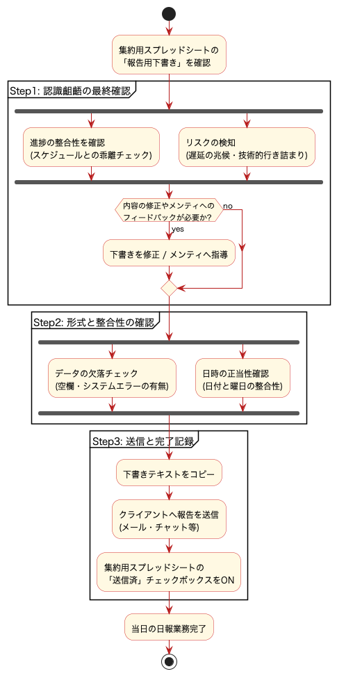

### 3.4 入力項目定義（Googleフォーム）
メンティが入力するGoogleフォームの設問項目です。
入力負荷軽減と集計データの品質担保のため、以下の構成とします。

* **日付**
* **形式**：カレンダー選択
* **目的**：報告対象日の特定

* **案件名**
* **形式**：記述式（※管理者配布の「事前入力URL」を使用）
* **目的**：プロジェクトの特定
* **備考**：管理者が発行する「案件名が入力された状態のURL」から回答させることで、メンティの入力負荷と表記揺れを同時に排除する。

* **作業内容**
* **形式**：記述式（※箇条書き推奨）
* **目的**：実施事項の報告

* **作業時間**
* **形式**：プルダウン（0.5h単位などで簡単に選択）
* **目的**：稼働時間の記録

* **GitHubのコミットPush**
* **形式**：ラジオボタン（はい / いいえ / 対象外）
* **目的**：ソースコード管理状況の確認

* **次回作業日**
* **形式**：ラジオボタン（明日 / 明後日 / それ以外▶日付入力へ）
* **目的**：スケジュール共有

* **課題、相談したいこと**
* **形式**：記述式
* **目的**：リスク・課題の吸い上げ（※特になければ「なし」）

#### 3.5 報告フォーマット定義
システムが自動生成する下書きの標準フォーマットです。
メンティの入力内容に基づいて、以下の形式で集約用スプレッドシートに出力されます。

> **件名：【作業報告】[氏名]（[日付]分）**
> **[クライアント担当者名] 様**
> お世話になっております。
> [氏名]です。
> 本日の作業内容をご報告いたします。
> **■ 勤務実績**
> [日付]（[曜日]） [作業時間]
> **■ 本日の作業内容**
> [作業詳細]
> **■ 進捗状況**
> ステータス：[進捗率]
> **■ 課題・懸念事項**
> [発生した課題・懸念]
> **■ 次回の予定**
> [明日の予定]
> 以上、よろしくお願いいたします。

※ [ ] の部分は、メンティの入力値またはマスタ設定値が埋め込まれます。

---

## 4. 一連の流れ（時系列）

### 4.1 メンティが日報を書く
**タイミング：業務終了後**

1. メンティは業務終了後、Googleフォームを開きます。
2. その日の「作業内容」「時間」「進捗状況」などを選択・入力し、送信します。
3. データは**個人用スプレッドシート**に保存されます。この時点では、システム処理用のチェックボックスは「未チェック（空欄）」の状態です。

  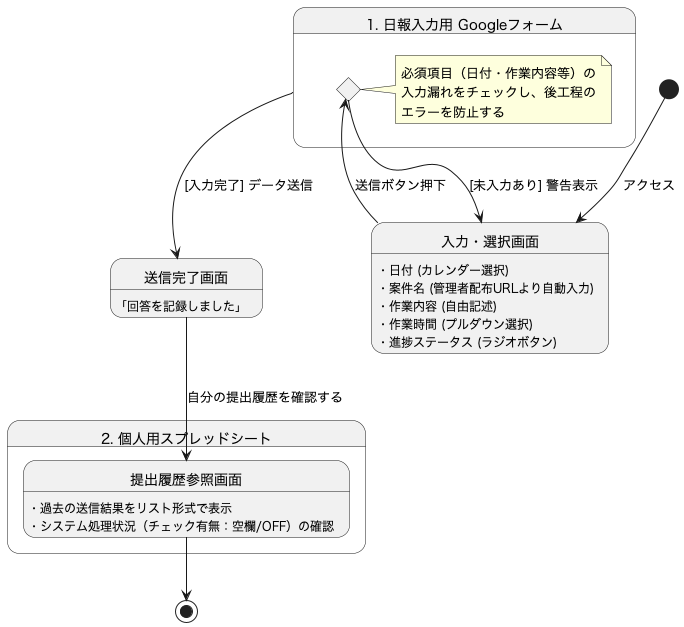

### 4.2 システムによる自動集約と下書き生成
**タイミング：設定された定刻 または 担当者による手動実行**

1. GASが自動的に（または手動トリガーで）起動します。
2. 個人用スプレッドシートを巡回し、「日付が入っている」かつ「未チェック」の行だけを特定します。
3. 該当データを取得し、不備がないか検証します。
4. 指定のフォーマットに整形し、**集約用スプレッドシート**へ「報告下書き」として書き込みます。
5. 書き込みが成功したデータに対して、個人用スプレッドシートのチェックボックスを「ON（処理済）」に変更します。

  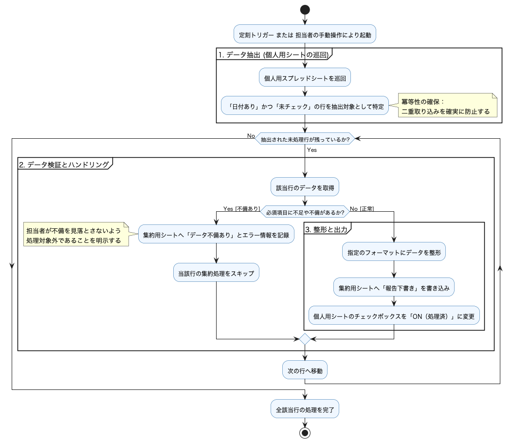

### 4.3 担当者による内容確認と修正
**タイミング：報告期限前**

1. 担当者は、**集約用スプレッドシート**を確認します。
2. 自動生成された下書きを読み、以下の点について判断します。
* **内容の整合性**: メンティの報告内容と、クライアントの認識にズレがないか。
* **リスク確認**: 進捗の遅れや、不適切な表現が含まれていないか。
3. 修正が必要な場合は、その場で下書きを編集します。
* ※ここで編集しても、メンティの元のデータには影響しません。

  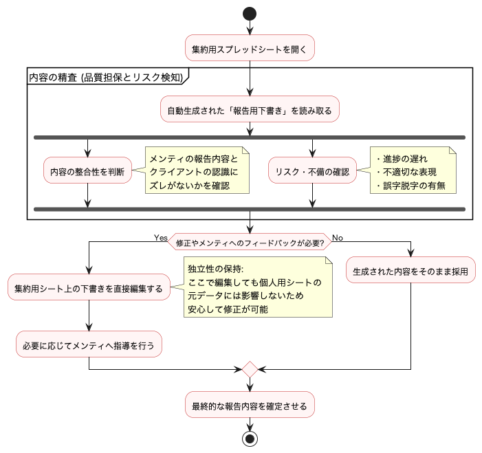

### 4.4 クライアントへの提出と完了記録
**タイミング：確認完了後、即時**

1. 内容に問題がないことを確認した後、担当者は下書きのテキストをコピーします。
2. メールやチャットツールに貼り付け、クライアントへ送信します。
3. 送信後、**集約用スプレッドシートの該当行にある「送信済チェック」をONにします。**
4. これをもって、その日の日報業務は完了となります。

  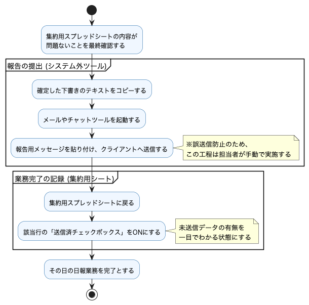

